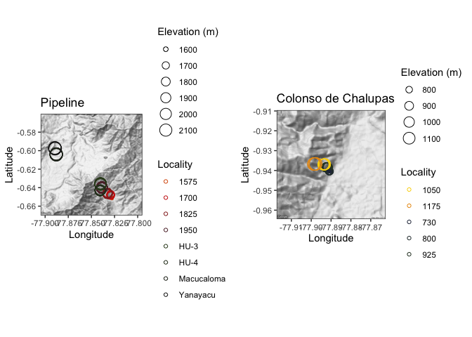
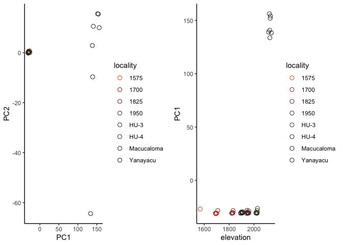
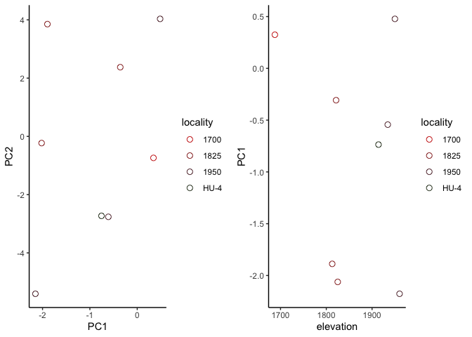
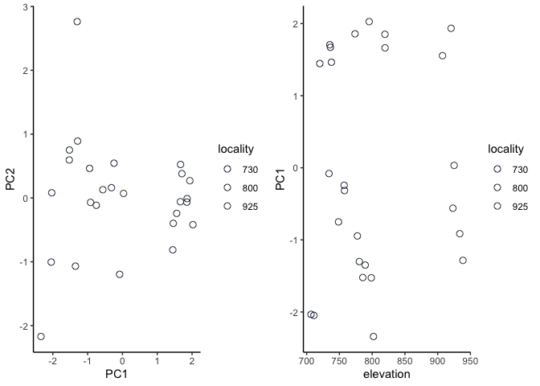
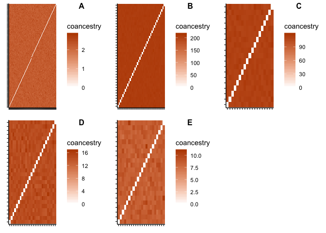

Scarab ddRADseq data analysis
================

## Demultiplexing and basic quality control

We’ve just recieved A LOT (9.39 GB) of data: 100 bp single-end read
sequencing data from 239 samples of 11 species of dung beetle
(Scarabaeinae), multiplexed on a single Illumina lane, to be precise.
Before we dig in to the all the interesting questions we want to ask
with it, we should do a basic check that the sequencing reaction was
successful, and that we don’t need to start from scratch (lolsob).
First, we need to demultiplex the original file,
`raw_data/UTN-DUNG_S167_L007_R1_001.fastq.gz1`, using the list of
barcodes we appended to each sample during library preparation
(`ipyrad/barcodes`). We can look at it and see it matches our
expectations for .fastq data, which I won’t display here. (Enter all
shell commands in the appropriate directory via terminal.)

``` bash
gunzip -c ~/Dropbox/scarab_migration/raw_data/UTN-DUNG_S167_L007_R1_001.fastq.gz | head -n 12
```

We’ll initially use the program `ipyrad` [which has extensive
documentation you can view here](https://ipyrad.readthedocs.io/) to
demultiplex this file into our original libraries. We first generate a
params file.

``` bash
ipyrad -n scarab
```

We modify the file `ipyrad/params-scarab.txt` to match our data and fill
in the appropriate paths to our data and barcode file. We then run the
first step of the ipyrad only, which we indicate with the `-s` option:

``` bash
ipyrad -p params-scarab.txt -s 1
```

When this completes, you’ll see the relevant directory fill with fastq
files, and a text file labeled `s1_demultiplex_stats.txt` generated. We
want to extract data on the total number of reads per library, and group
libraries by species. First, we’ll read in the (unformatted) stats file
and select only the information we want:

``` r
setwd("~/Dropbox/scarab_migration/ipyrad/")
file <- "s1_demultiplex_stats.txt"
nsamples <- 239
raw <- readLines("s1_demultiplex_stats.txt",warn=FALSE)
a <- grep("sample_name",raw) # where the data begins
a <- a[1] 
reads <- read.table(file,skip=(a),nrow=(nsamples))
colnames(reads) <- c("sample_ID", "read_count")
```

We know have a simple two column data frame to play around with. We will
do some tedious substitution of our field-based morphospecies assignment
shorthand with the real species IDs:

``` r
reads$sample_ID <- gsub("EU","Eurysternus_affin",reads$sample_ID)
reads$sample_ID <- gsub("DI1","Dichotomious_satanas",reads$sample_ID)
reads$sample_ID <- gsub("DI5","Dichotomious_satanas",reads$sample_ID)
reads$sample_ID <- gsub("DI7","Dichotomious_podalirius",reads$sample_ID)
reads$sample_ID <- gsub("DE2","Deltochilum_tesselatum",reads$sample_ID)
reads$sample_ID <- gsub("DE1","Deltochilum_speciosissimum",reads$sample_ID)
reads$sample_ID <- gsub("DE9","Deltochilum_speciosissimum",reads$sample_ID)
reads$sample_ID <- gsub("239","Dichotomious_protectus",reads$sample_ID)
reads$sample_ID <- gsub("238","Dichotomious_protectus",reads$sample_ID)
reads$sample_ID <- gsub("219","Deltochilum_amazonicum",reads$sample_ID)
reads$sample_ID <- gsub("220","Coprophanaeus_telamon",reads$sample_ID)
reads$sample_ID <- gsub("217","Phanaeus_meleagris",reads$sample_ID)
reads$sample_ID <- gsub("218","Phanaeus_meleagris",reads$sample_ID)
reads$sample_ID <- gsub("223","Oxysternon_silenus",reads$sample_ID)
reads$sample_ID <- gsub("222","Oxysternon_silenus",reads$sample_ID)
reads$sample_ID <- gsub("221","Oxysternon_conspicullatum",reads$sample_ID)
reads$sample_ID <- gsub('-.*', '', reads$sample_ID) # drop numbers
colnames(reads) <- c("Species","Read_count")
reads$Read_count <- as.numeric(as.character(reads$Read_count))
```

Kind of a mess, but that’s biology\! Now we’ll plot it.

<!-- -->

So far so good: pretty even sequencing effort across the five species
we’re interested in with the most data.

## Data assembly

Now that we’re comfortable we sequenced *something*, we’re going to try
and assemble the remainder of our data. We’re only going to analyze the
five species with reasonable sampling: *Deltochilum speciocissimum*,
*Deltochilum tesselatum*, *Dichotomius podalirius*, *Dichotomius
satanas*, and *Eurysternus affin*. We’ll run the rest of the assembly
and variant calling steps using [Jon Puritz’ dDocent
pipeline](https://www.ddocent.com/), which is optimized for nonmodel
organisms and does a good job maximizing the signal to noise ratio in
tricky denovo assemblies. First, we’ll make separate directories and
move our files (named by their initial morphospecies ID codes) to them.
We’ll then use a bash oneliner paired with files linking our current
sample names to a modified sample name format dDocent requires to get
ready to run the pipeline. Finally, we’ll run dDocent using a set of
config files for each species; these are largely the same, except for a
more lenient clustering threshhold for *D. satanas* based on exploratory
data analysis.

``` bash

# make directories
mkdir d_speciocissimum
mkdir d_tesselatum
mkdir d_podalirirus
mkdir d_satanas
mkdir e_affin

# move files
mv DE1* d_speciocissimum/
mv DE9* d_speciocissimum/ # two morphospecies lumped into one species
mv DE2* d_tesselatum/
mv DI7* d_podalirius/ 
mv DI1* d_satanas/
mv DI5* d_satanas/
mv EU* e_affin/ 

# rename files
cd d_speciocissimum/; eval "$(sed 's/^/mv /g' d_spec_rename.txt )"; cd ../.
cd d_tesselatum/; eval "$(sed 's/^/mv /g' d_tess_rename.txt )"; cd ../.
cd d_podalirius/; eval "$(sed 's/^/mv /g' d_pod_rename.txt )"; cd ../.
cd d_satanas/; eval "$(sed 's/^/mv /g' d_satanas_rename.txt )"; cd ../.
cd e_affin/; eval "$(sed 's/^/mv /g' e_affin_rename.txt )"; cd ../.

# run independently;
cd d_speciocissimum/; dDocent d_spec_config.file; cd ../.
cd d_tesselatum/; dDocent d_tess_config.file; cd ../.
cd d_podalirius/; dDocent d_pod_config.file; cd ../.
cd d_satanas/; dDocent d_satanas_config.file; cd ../.
cd e_affin/; dDocent e_affin_config.file; cd ../.
```

The output we’re interested in are .vcf files; we’ll be working with
these for the rest of the analysis. First, though, we’ll run a set of
standard filtering steps on the .vcf files for each species. We’re going
to drop any individuals with missing data at more than 30% of loci, any
loci missing data at more than 25% of individuals, all SNPs with a
minimum minor allele frequency of 0.05 and a minimum minor allele count
of 3, all SNPs with a quality (Phred) score of \<30, and any genotypes
with fewer than 5 reads across all individuals. We’ll then run dDocent’s
`dDocent_filter` command, which further trims for allelic balance,
depth, and other parameters you can read about in the [program’s
documentation](https://www.ddocent.com/filtering/). All are very
sensible. I’ve put all my commands together in a simple bash script,
`snp_filtering.sh`, but let the buyer beware: it’s written to be a
record of what I did, and not reproducible, although it would be easy
enough to tweak. For now, we’ll run it as I did, with a single command:

``` bash
bash scripts/snp_filtering.sh
```

Download these from your cluster, or whereever you’re running your
analyses. From here on out, we’ll be working in `R`.

## Plotting sampling localities

Before we start analyzing our genotypic data in R, it will be useful to
visualize where we collected our samples. We’ll do this using the
`ggmap` package and our coordinate data in `data/scarab_spp_master.csv`.
We’ll also set up a common color palette to use for the remainder of our
study. First, we’ll load our data, and use a Google Maps API to grab
contour maps of our field sites.

``` r
library(ggmap)
library(wesanderson)
library(gridExtra)

# read in locality data
localities <- read.csv("/Users/ethanlinck/Dropbox/scarab_migration/data/scarab_spp_master.csv")
levels(localities$locality) # see levels 
```

    ##  [1] "CC1-730"    "CC1-800"    "CC2-925"    "CC3-1050"   "CC4-1175"  
    ##  [6] "HU-1575"    "HU-1700"    "HU-1825"    "HU-1950"    "HU-3"      
    ## [11] "HU-4"       "Macucaloma" "Yanayacu"

``` r
localities$transect <- ifelse(grepl("CC",localities$locality),'colonso','pipeline') # add levels for transects

# pick the center point for our maps, and an appropriate zoom level
pipeline <- get_map(location=c(lon=-77.85, lat=-0.615), zoom = 13, color = "bw")
colonso <- get_map(location=c(lon=-77.89, lat=-0.937), zoom = 14, color = "bw")

# subset locality data by transect
df.pipeline <- localities[localities$transect=='pipeline',]
df.colonso <- localities[localities$transect=='colonso',]
```

We’ll use the “Darjeeling1” palette from the [wesanderson
package](https://github.com/karthik/wesanderson), but build a custom
palette so we can hold colors constant across the levels of our sampling
localities.

``` r
pal <- wes_palette("Darjeeling1", 14, type = "continuous")
scale_color_wes <- function(...){
    ggplot2:::manual_scale(
        'color', 
        values = setNames(pal, levels(localities$short_locality)), 
        ...
    )
}
```

Now, we’ll plot these using [ggmap](https://github.com/dkahle/ggmap).

<!-- -->

Not quite publication quality, but good enough for now.

## Testing for genetic differentiation

Now that we’re somewhat spatially oriented, we’ll dive in to analyzing
our genotypic data. Our driving question is whether dispersal (and gene
flow) is reduced across elevational gradients relative to within an
elevational band. We are going to try and answer this question in a
number of ways. An important first step is running principle component
analysis to ask whether there is population genetic structure, and
whether it relates to elevation. We’ll read in locality data, our .vcf
files, and run principle component analysis on each species in turn.
This will involve redundant chunks of code. First, *Dichotomius
satanas*, our species with the most throrough sampling (*n*=100).

``` r
# load libraries
library(vcfR)
library(adegenet)
library(ggplot2)
library(wesanderson)
library(tidyverse)
library(reshape2)
library(patchwork)

# set wd and read in locality data
localities <- read.csv("/Users/ethanlinck/Dropbox/scarab_migration/data/scarab_spp_master.csv")

### d. satanas ###

# read in .vcf and sample / pop names; convert to genlight
satanas.vcf <- read.vcfR("/Users/ethanlinck/Dropbox/scarab_migration/raw_data/d_satanas_filtered.FIL.recode.vcf", verbose = FALSE)

# pca 
satanas.dna <- vcfR2DNAbin(satanas.vcf, unphased_as_NA = F, consensus = T, extract.haps = F)
satanas.gen <- DNAbin2genind(satanas.dna)
satanas.pops <-  gsub( "_.*$", "", rownames(satanas.gen@tab))
satanas.gen@pop <- as.factor(satanas.pops)
satanas.scaled <- scaleGen(satanas.gen,NA.method="zero",scale=F)
satanas.pca <- prcomp(satanas.scaled,center=F,scale=F)
satanas.pc <- data.frame(satanas.pca$x[,1:3])
satanas.pc$sample <- rownames(satanas.pc)
satanas.pc$pop <- satanas.pops
satanas.pc$species <- rep("Dichotomius_satanas",nrow(satanas.pc))
```

We’ve run PCA and merged the first three PC axes with our sampling data.
Let’s plot PC1 and PC2, and also plot PC1 against elevation. (Note that
the colors will jump around during these initial plots, but will match
our sampling locality map once we’ve merged the different data frames.
So fear not\!)

<!-- -->

Looks like panmixia to me, but otherwise reasonable, with no wild
outliers. We’ll continue as before for the remaining four species. Next
up is *Deltochilum speciocissimum*.

``` r
# read in .vcf and sample / pop names; convert to genlight
spec.vcf <- read.vcfR("/Users/ethanlinck/Dropbox/scarab_migration/raw_data/d_spec_filtered.FIL.recode.vcf", verbose = FALSE)

# pca 
spec.dna <- vcfR2DNAbin(spec.vcf, unphased_as_NA = F, consensus = T, extract.haps = F)
spec.gen <- DNAbin2genind(spec.dna)
spec.pops <-  gsub( "_.*$", "", rownames(spec.gen@tab))
spec.gen@pop <- as.factor(spec.pops)
spec.scaled <- scaleGen(spec.gen,NA.method="mean",scale=F)
spec.pca <- prcomp(spec.scaled,center=F,scale=F)
spec.pc <- data.frame(spec.pca$x[,1:3])
spec.pc$sample <- rownames(spec.pc)
spec.pc$pop <- spec.pops
spec.pc$species <- rep("Deltochilum_speciocissimum",nrow(spec.pc))

# merge with sample data
spec.pc <- merge(spec.pc, localities, by.x = "sample", by.y = "ddocent_ID")
```

Plots:

<!-- -->

Looks reasonable. This time, we see strong popualtion genetic structure
that largely segregates across the Cosanga river. A curious exception is
a sample at the 2150 locality, which might represent a recent migrant.
Now, we’ll look at *Deltochilum tesselatum*.

``` r
# read in .vcf and sample / pop names; convert to genlight
tess.vcf <- read.vcfR("/Users/ethanlinck/Dropbox/scarab_migration/raw_data/d_tess_filtered.FIL.recode.vcf", verbose = FALSE)

# pca 
tess.dna <- vcfR2DNAbin(tess.vcf, unphased_as_NA = F, consensus = T, extract.haps = F)
tess.gen <- DNAbin2genind(tess.dna)
tess.pops <-  gsub( "_.*$", "", rownames(tess.gen@tab))
tess.gen@pop <- as.factor(tess.pops)
tess.scaled <- scaleGen(tess.gen,NA.method="mean",scale=F)
tess.pca <- prcomp(tess.scaled,center=F,scale=F)
tess.pc <- data.frame(tess.pca$x[,1:3])
tess.pc$sample <- rownames(tess.pc)
tess.pc$pop <- tess.pops
tess.pc$species <- rep("Deltochilum_tesselatum",nrow(tess.pc))

# merge with sample data
tess.pc <- merge(tess.pc, localities, by.x = "sample", by.y = "ddocent_ID")
```

Plots:

<!-- -->

Panmixia again, although there are fewer samples. Now, *Dichotomius
podalirius*.

``` r
# read in .vcf and sample / pop names; convert to genlight
pod.vcf <- read.vcfR("/Users/ethanlinck/Dropbox/scarab_migration/raw_data/d_pod_filtered.FIL.recode.vcf", verbose = FALSE)

# pca 
pod.dna <- vcfR2DNAbin(pod.vcf, unphased_as_NA = F, consensus = T, extract.haps = F)
pod.gen <- DNAbin2genind(pod.dna)
pod.pops <-  gsub( "_.*$", "", rownames(pod.gen@tab))
pod.gen@pop <- as.factor(pod.pops)
pod.scaled <- scaleGen(pod.gen,NA.method="mean",scale=F)
pod.pca <- prcomp(pod.scaled,center=F,scale=F)
pod.pc <- data.frame(pod.pca$x[,1:3])
pod.pc$sample <- rownames(pod.pc)
pod.pc$pop <- pod.pops
pod.pc$species <- rep("Dichotomius_podalirius",nrow(pod.pc))

# merge with sample data
pod.pc <- merge(pod.pc, localities, by.x = "sample", by.y = "ddocent_ID")
```

Plots:

<!-- -->

Again, a big mess. Note that we have fewer sampling localities here, and
that they are from the Colonso de Chalupas gradient. We’ll now run our
final species, *Eurysternus affin*, which is also from Colonso de
Chalupas.

``` r
# read in .vcf and sample / pop names; convert to genlight
affin.vcf <- read.vcfR("/Users/ethanlinck/Dropbox/scarab_migration/raw_data/e_affin_filtered.FIL.recode.vcf", verbose = FALSE)

# pca 
affin.dna <- vcfR2DNAbin(affin.vcf, unphased_as_NA = F, consensus = T, extract.haps = F)
affin.gen <- DNAbin2genind(affin.dna)
affin.pops <-  gsub( "_.*$", "", rownames(affin.gen@tab))
affin.gen@pop <- as.factor(affin.pops)
affin.scaled <- scaleGen(affin.gen,NA.method="mean",scale=F)
affin.pca <- prcomp(affin.scaled,center=F,scale=F)
affin.pc <- data.frame(affin.pca$x[,1:3])
affin.pc$sample <- rownames(affin.pc)
affin.pc$pop <- affin.pops
affin.pc$species <- rep("Eurysternus_affin",nrow(affin.pc))

# merge with sample data
affin.pc <- merge(affin.pc, localities, by.x = "sample", by.y = "ddocent_ID")
```

Plots:

<!-- -->

This is interesting: two extreme outliers. Let’s figure out what they
are.

``` r
# drop outliers
drop <- affin.pc[which(affin.pc$PC1>5),] 
drop <- drop$sample
drop
```

    ## [1] "1175_137" "1175_138"

Turns out these two samples were marked as potentially belonging to a
species other than *E. affin*. Seems like that’s almost certainly the
case, so let’s drop them from the dataset, and merge all our separate
data frames.

``` r
affin.gen <- affin.gen[indNames(affin.gen)!=drop[1] & indNames(affin.gen)!=drop[2]]
affin.pops <-  gsub( "_.*$", "", rownames(affin.gen@tab))
affin.gen@pop <- as.factor(affin.pops)
affin.scaled <- scaleGen(affin.gen,NA.method="mean",scale=F)
affin.pca <- prcomp(affin.scaled,center=F,scale=F)
affin.pc <- data.frame(affin.pca$x[,1:3])
affin.pc$sample <- rownames(affin.pc)
affin.pc$pop <- affin.pops
affin.pc$species <- rep("Eurysternus_affin",nrow(affin.pc))

# merge with sample data
affin.pc <- merge(affin.pc, localities, by.x = "sample", by.y = "ddocent_ID")

# merge all data frames
master.df <- rbind.data.frame(satanas.pc,spec.pc,tess.pc,pod.pc,affin.pc)
```

Now’ let’s plot all these together with faceting.

<!-- -->

This still looks a lot like panmixia, but this will be useful going
forward, as we know we won’t be violating model assumptions for future
analyses (at least except for *D. speciocissimum*, which we’ll have to
deal with later).

## fineRADstructure

As a slightly more robust and sensitive approach to detecting population
structure, we’re going to estimate a covariance ancestry matrix among
individuals using
[fineRADstructure](https://github.com/millanek/fineRADstructure), which
works by estimating nearest-neighor relationships among haploytypes.
First, we’re going to drop indviduals from our .vcfs that appear to be
from cryptic species or highly divergent subspecies (as identified by
PCA above). Navigate to the `raw_data/` folder.

``` bash
vcftools --remove-indv 2150_132 --remove-indv MA2150_224 --remove-indv MA2150_226 --remove-indv MA2150_227 --remove-indv MA2150_230 --remove-indv MA2150_232 --remove-indv MA2150_233 --remove-indv YY2150_235 --vcf d_spec_filtered.FIL.recode.vcf --recode --out d_spec_filtered.strict.recode.vcf 
vcftools --remove-indv 1175_137 --remove-indv 1175_138 --vcf e_affin_filtered.FIL.recode.vcf --recode --out e_affin_filtered.strict.recode.vcf
```

Next, we need to convert our .vcfs into the haplotype format used by
fineRADstructure.

``` bash
./RADpainter hapsFromVCF ~/Dropbox/scarab_migration/raw_data/d_satanas_filtered.FIL.recode.vcf > ~/Dropbox/scarab_migration/raw_data/d_satanas_painter.txt
./RADpainter hapsFromVCF ~/Dropbox/scarab_migration/raw_data/d_spec_filtered.strict.recode.vcf > ~/Dropbox/scarab_migration/raw_data/d_spec_painter.txt
./RADpainter hapsFromVCF ~/Dropbox/scarab_migration/raw_data/d_tess_filtered.FIL.recode.vcf > ~/Dropbox/scarab_migration/raw_data/d_tess_painter.txt
./RADpainter hapsFromVCF ~/Dropbox/scarab_migration/raw_data/d_pod_filtered.FIL.recode.vcf > ~/Dropbox/scarab_migration/raw_data/d_pod_painter.txt
./RADpainter hapsFromVCF ~/Dropbox/scarab_migration/raw_data/e_affin_filtered.strict.recode.vcf > ~/Dropbox/scarab_migration/raw_data/e_affin_painter.txt
```

Next, we’re going to run the `paint` command to generate the coancestry
matrices.

``` bash
./RADpainter paint ~/Dropbox/scarab_migration/raw_data/d_satanas_painter.txt 
./RADpainter paint ~/Dropbox/scarab_migration/raw_data/d_spec_painter.txt 
./RADpainter paint ~/Dropbox/scarab_migration/raw_data/d_tess_painter.txt 
./RADpainter paint ~/Dropbox/scarab_migration/raw_data/d_pod_painter.txt 
./RADpainter paint ~/Dropbox/scarab_migration/raw_data/e_affin_painter.txt 
```

We then import these data into `R`, and manipluate the data into the
proper format for plotting with `geom_tile()`. This is a bit redundant
for each species, so I’ll put all the code here with minimal annotation.

``` r
# d. satanas

# load and format correlation matrix
satanas <- as.matrix(read.table("~/Dropbox/scarab_migration/raw_data/d_satanas_painter_chunks.out"))
colnames(satanas) <- NULL
names <- as.vector(satanas[,1])[-1]
satanas <- satanas[-1,]
satanas <- satanas[,-1]
colnames(satanas) <- names
rownames(satanas) <- names
class(satanas) <- "numeric"

# melt df
melted_satanas<- melt(satanas)
melted_satanas$pop.x <- gsub( "_.*$", "", melted_satanas$Var1) %>% as.factor()
melted_satanas$pop.y <- gsub( "_.*$", "", melted_satanas$Var2) %>% as.factor()

# d. speciocissimum

# load and format correlation matrix
spec <- as.matrix(read.table("~/Dropbox/scarab_migration/raw_data/d_spec_painter_chunks.out"))
colnames(spec) <- NULL
names <- as.vector(spec[,1])[-1]
spec <- spec[-1,]
spec <- spec[,-1]
colnames(spec) <- names
rownames(spec) <- names
class(spec) <- "numeric"

# melt df
melted_spec<- melt(spec)
melted_spec$pop.x <- gsub( "_.*$", "", melted_spec$Var1) %>% as.factor()
melted_spec$pop.y <- gsub( "_.*$", "", melted_spec$Var2) %>% as.factor()

# d tesselatum

# load and format correlation matrix
tess <- as.matrix(read.table("~/Dropbox/scarab_migration/raw_data/d_tess_painter_chunks.out"))
colnames(tess) <- NULL
names <- as.vector(tess[,1])[-1]
tess <- tess[-1,]
tess <- tess[,-1]
colnames(tess) <- names
rownames(tess) <- names
class(tess) <- "numeric"

# melt df
melted_tess<- melt(tess)
melted_tess$pop.x <- gsub( "_.*$", "", melted_tess$Var1) %>% as.factor()
melted_tess$pop.y <- gsub( "_.*$", "", melted_tess$Var2) %>% as.factor()

# d. podalirius

# load and format correlation matrix
pod<- as.matrix(read.table("~/Dropbox/scarab_migration/raw_data/d_pod_painter_chunks.out"))
colnames(pod) <- NULL
names <- as.vector(pod[,1])[-1]
pod <- pod[-1,]
pod <- pod[,-1]
colnames(pod) <- names
rownames(pod) <- names
class(pod) <- "numeric"

# melt df
melted_pod<- melt(pod)
melted_pod$pop.x <- gsub( "_.*$", "", melted_pod$Var1) %>% as.factor()
melted_pod$pop.y <- gsub( "_.*$", "", melted_pod$Var2) %>% as.factor()

# load and format correlation matrix
affin <- as.matrix(read.table("~/Dropbox/scarab_migration/raw_data/e_affin_painter_chunks.out"))
colnames(affin) <- NULL
names <- as.vector(affin[,1])[-1]
affin <- affin[-1,]
affin <- affin[,-1]
colnames(affin) <- names
rownames(affin) <- names
class(affin) <- "numeric"

# melt df
melted_affin<- melt(affin)
melted_affin$pop.x <- gsub( "_.*$", "", melted_affin$Var1) %>% as.factor()
melted_affin$pop.y <- gsub( "_.*$", "", melted_affin$Var2) %>% as.factor()
```

Then, we plot our coancestry matrices:

<!-- -->

I left off axis labels because it made the figure too chaotic, but
essentially what we’re looking for here are contiguous chunks of similar
coancestry, indicating population genetic structure. There’s clearly
none in any of these species, providing more evidence of panmixia.

## Testing for isolation by environment

Next, we’re going to use [Bradburd et al.’s
BEDASSLE](http://www.genescape.org/bedassle.html) to estimate the
relative contribution of isolation by environment and isolation by
distance to genetic differentiaiton. For this analysis, we’ll need to
trim all our SNPs trim our SNPs for LD, which we’ll do on the raw .vcf
files using [bcftools](https://samtools.github.io/bcftools/) and
r<sup>2</sup> value of 0.1:

``` bash
bcftools +prune -l 0.1 -w 1000 d_satanas_filtered.FIL.recode.vcf -Ov -o d_satanas.LD.vcf
bcftools +prune -l 0.1 -w 1000 d_spec_filtered.strict.recode.vcf -Ov -o d_spec.LD.vcf
bcftools +prune -l 0.1 -w 1000 d_tess_filtered.FIL.recode.vcf -Ov -o d_tess.LD.vcf
bcftools +prune -l 0.1 -w 1000 d_pod_filtered.FIL.recode.vcf -Ov -o d_pod.LD.vcf
bcftools +prune -l 0.1 -w 1000 e_affin_filtered.strict.recode.vcf -Ov -o e_affin.LD.vcf
```

We need to read in locality data and use this tp calculate geographic
distance with
[fossil’s](https://cran.r-project.org/web/packages/fossil/index.html)
`earth.dist()` function.

``` r
library(adegenet)
library(BEDASSLE)
library(dplyr)
library(ggplot2)
library(broom)
library(data.table)
library(vcfR)
library(fossil)
library(viridis)
library(patchwork)
library(sp)
library(raster)
library(ecodist)
library(radiator)
library(wesanderson)

# set wd and read in locality data
setwd("/Users/ethanlinck/Dropbox/scarab_migration/")
localities <- read.csv("data/scarab_spp_master.csv")
localities$short_locality[which(localities$short_locality=="730")] <- 800
pop.loc <- cbind.data.frame(unique(localities$long),unique(localities$lat),unique(localities$short_locality))
colnames(pop.loc) <- c("long", "lat", "pop")
geodist <- earth.dist(pop.loc[c("long", "lat")], dist = FALSE)
```

We then will calculate *environmental* distances using the
[raster](https://cran.r-project.org/web/packages/raster/index.html)
package, which directly collects data from the [WorldClim climate
database](https://www.worldclim.org/). In addition to our elevational
data, we’ll use mean annual temperature and mean annual precipitation
(the bio1 and bio12 variables).

``` r
# calculate environmental distance
worldclim <- getData("worldclim",var="bio",res=0.5,lon=localities$long[1],lat=localities$lat[1])
proj <- as.character(worldclim[[2]]@crs)
worldclim <- worldclim[[c(1,12)]]
names(worldclim) <- c("temp","precip")
sp1 <- SpatialPoints(localities[,c('long', 'lat')], proj4string=CRS(proj))
values <- extract(worldclim, sp1)
loc.master <- cbind.data.frame(localities, values)
loc.uniq <- cbind.data.frame(loc.master$locality, loc.master$elevation, loc.master$temp,
                             loc.master$precip) %>% distinct()
colnames(loc.uniq) <- c("population", "elevation", "temp", "precip")
rownames(loc.uniq) <- loc.uniq$population
loc.uniq <- as.data.frame(loc.uniq)
loc.uniq <- loc.uniq[,-which(names(loc.uniq) %in% c("population"))]
env.dist.all <- dist(loc.uniq, diag = TRUE, upper = TRUE)
```

Now we have to do some serious manipulation to the format of our
genotypic data to get it into BEDASSLE. I’ll run through the whole
procedure (from data frame manipulation to the MCMC run) for *D.
satanas* in detail, and then keep it short for the remainder of the
species. (This code is also found in `scripts/bedassle.R`). First, we’ll
read our .vcf as usual, and convert it to adegenet’s genpop format,
which is pretty close to what BEDASSLE wants in that it is a summary of
allele counts across populations. We’ll set populations by grabbing the
first part of each sample ID.

``` r
# read in .vcf, turn to genpop
satanas.vcf <- read.vcfR("~/Dropbox/scarab_migration/raw_data/d_satanas.LD.vcf", convertNA=TRUE, verbose = FALSE)
satanas.gen <- vcfR2genind(satanas.vcf) 
md <- propTyped(satanas.gen, by=c("both")) # confirm we have expected amount of missing data
table(md)[1]/table(md)[2] # proportion of missing sites
```

    ##          0 
    ## 0.05375595

``` r
# table(satanas.gen@tab) # distribution of genotypes
satanas.pops <-  gsub( "_.*$", "", rownames(satanas.gen@tab)) # add pops
satanas.gen@pop <- as.factor(satanas.pops) # make factor
satanas.b <- genind2genpop(satanas.gen, satanas.pops, quiet = TRUE) # turn into gen pop
```

Next, we’ll turn this into a matrix, and delete every other column, as
the genpop format included information on both the reference and alt
alleles, while BEDASSLE only needs one.

``` r
# convert to BEDASSLE format
satanas.ac <- as.matrix(satanas.b@tab)
del <- seq(2, ncol(satanas.ac), 2) # sequence of integers to drop non-ref allele
satanas.ac <- satanas.ac[,-del] 
```

We need to create a paired matrix with sample sizes (in chromosomes,
e.g. n\*2 for our diploid beetles). We’ll set the same dimensions and
use a loop with sample size information to populate it.

``` r
# create equally sized matrix for sample sizes
satanas.n <- matrix(nrow=nrow(satanas.ac), ncol=ncol(satanas.ac))

# name our rows the same thing
rownames(satanas.n) <- rownames(satanas.ac)

# get sample size per population
sample.n <- table(satanas.gen@pop) 

# turn this into a vector
sample.sizes <- as.vector(sample.n)

# populate each row of matrix with sample sizes for pops
for(i in 1:nrow(satanas.n)){
  satanas.n[i,] <- sample.sizes[i]
}
satanas.n <- satanas.n*2 # adjust to account for loss of one allele
```

While we’re at it, we’ll calculate pairwise FST.

``` r
# calculate pairwise Fst
satanas.p.fst.all <- calculate.all.pairwise.Fst(satanas.ac, satanas.n)
satanas.p.fst.all
```

    ##             [,1]        [,2]        [,3]        [,4]        [,5]
    ## [1,]  0.00000000 -0.01389764 -0.01894285 -0.01126266 -0.02618995
    ## [2,] -0.01389764  0.00000000 -0.01970698 -0.01412796 -0.02642221
    ## [3,] -0.01894285 -0.01970698  0.00000000 -0.01690362 -0.03351763
    ## [4,] -0.01126266 -0.01412796 -0.01690362  0.00000000 -0.02334850
    ## [5,] -0.02618995 -0.02642221 -0.03351763 -0.02334850  0.00000000
    ## [6,] -0.02282667 -0.02351437 -0.02850475 -0.02160436 -0.03300329
    ## [7,] -0.04527848 -0.04887616 -0.05530750 -0.04504069 -0.06480399
    ## [8,] -0.04372206 -0.04519955 -0.04300084 -0.04005624 -0.05617999
    ##             [,6]        [,7]        [,8]
    ## [1,] -0.02282667 -0.04527848 -0.04372206
    ## [2,] -0.02351437 -0.04887616 -0.04519955
    ## [3,] -0.02850475 -0.05530750 -0.04300084
    ## [4,] -0.02160436 -0.04504069 -0.04005624
    ## [5,] -0.03300329 -0.06480399 -0.05617999
    ## [6,]  0.00000000 -0.05464144 -0.05240501
    ## [7,] -0.05464144  0.00000000 -0.08238505
    ## [8,] -0.05240501 -0.08238505  0.00000000

``` r
# look at global Fst
satanas.p.fst <- calculate.pairwise.Fst(satanas.ac, satanas.n)
satanas.p.fst
```

    ## [1] 0.01347148

Some negative values, which are an artifact of how BEDASSLE uses Weir
and Hill’s \(\theta\) as our estimator but generally confirms we have no
subdivision among our populations.

Now, we need restrict our geographic distance matrix to only those
populations we’re interested in, and turn this into a data frame.

``` r
drop.pop <- c("800","925","1050","1175")

# drop levels and calc distance
pop.loc.sat <- pop.loc[!pop.loc$pop %in% drop.pop,]
droplevels(pop.loc.sat)
satanas.geo <- earth.dist(pop.loc.sat[c("long", "lat")], dist = FALSE)

# turn to vectors
sat.dist <- as.vector(satanas.geo)
sat.gen <- as.vector(satanas.p.fst.all)

# make data frame with these variables
sat.df <- cbind.data.frame(sat.dist, sat.gen)
sat.df$species <- rep("dichotomius_satanas",nrow(sat.df))
colnames(sat.df) <- c("distance", "fst", "species")
```

We’ll do the same for our environmental distance matrix, and remove
column- and rownames to prepare it for BEDASSLE.

``` r
# drop lower transect
loc.subset <- loc.uniq[-which(rownames(loc.uniq) %in% 
                                       c("CC1-800","CC2-925","CC3-1050","CC4-1175","CC1-730")),]
env.dist.upper <- dist(loc.subset, diag = TRUE, upper = TRUE)

# prep dist matrix
satanas.env <- as.matrix(env.dist.upper)
colnames(satanas.env) <- NULL
rownames(satanas.env) <- NULL
```

Finally, we run the MCMC itself. Note the various parameters we can
tweak. For now, we’re only running it for 10,000 generations; for
publication we’re going to aim for 500K to 1000K.

``` r
# run MCMC for 10K gens
MCMC(   
  counts = satanas.ac,
  sample_sizes = satanas.n,
  D = satanas.geo,  # geographic distances
  E = satanas.env,  # environmental distances
  k = nrow(satanas.ac), loci = ncol(satanas.ac),  # dimensions of the data
  delta = 0.0001,  # a small, positive, number
  aD_stp = 0.1,   # step sizes for the MCMC
  aE_stp = 0.1,
  a2_stp = 0.025,
  thetas_stp = 0.2,
  mu_stp = 0.35,
  ngen = 10000,        # number of steps (2e6)
  printfreq = 100,  # print progress (10000)
  savefreq = 100,     # save out current state
  samplefreq = 2,     # record current state for posterior (2000)
  prefix = "/Users/ethanlinck/Dropbox/scarab_migration/bedassle/satanas_",   # filename prefix
  continue=FALSE,
  continuing.params=NULL)
```

Once this has run, we’re going to perform some basic examination of how
well the chain performed, using code and the procedure from [Peter
Ralph’s BEDASSLE
tutorial](http://petrelharp.github.io/popgen-visualization-course/).
I’ll show the output so you can see the different objects we have to
play with.

    ##  [1] "last.params"   "LnL_thetas"    "LnL_counts"    "LnL"          
    ##  [5] "Prob"          "a0"            "aD"            "aE"           
    ##  [9] "a2"            "beta"          "samplefreq"    "ngen"         
    ## [13] "a0_moves"      "aD_moves"      "aE_moves"      "a2_moves"     
    ## [17] "thetas_moves"  "mu_moves"      "beta_moves"    "aD_accept"    
    ## [21] "aE_accept"     "a2_accept"     "thetas_accept" "mu_accept"    
    ## [25] "aD_stp"        "aE_stp"        "a2_stp"        "thetas_stp"   
    ## [29] "mu_stp"

<!-- --><!-- --><!-- --><!-- --><!-- -->

While it certainly didn’t converge, it’s headed in the right direction,
and we can see the posterior is heavily weighted towards the aE/aD ratio
we expect, e.g. very little to very little (because there is very little
differentiation). We’ll save this in a data frame we’ll later use to
make a nicer looking figure.

``` r
# convert for ggplotting
sat.ratio <- aE/aD %>% as.data.frame()
sat.bed.df <- cbind.data.frame(sat.ratio, rep("dichotomius_satanas", nrow(sat.ratio)))
colnames(sat.bed.df) <- c("ratio","species")
```

Phew\! Only four more species to go. As I mentioned above, I’m going to
skip the details of these runs and get to what we’re interested in,
which is the posterior probabilities of the aE/aD ratio for all of them.
To do this, I’m going to load the completed MCMC outputs from all
species, and merge the ratio into a data frame.

Now, let’s check it out.

<!-- -->

Again, we’re having some issues with convergence, but the weight of the
distributions is very low. Mountain passes *aren’t* higher for these
beetles, at least within their elevation range\! (Next week I’ll
estimate neighborhood size and effective population size across their
ranges, and *maybe* do some demographic modeling to confirm what we
already know.)
