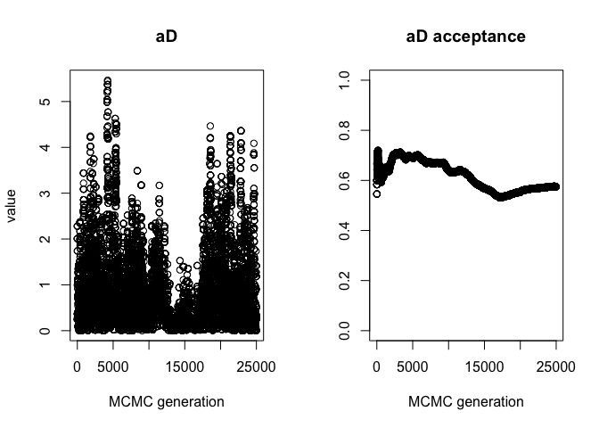
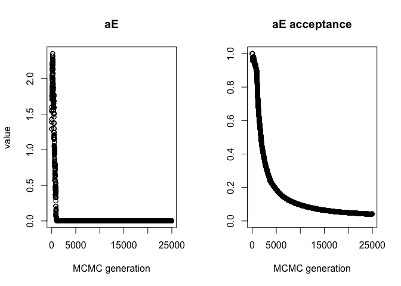
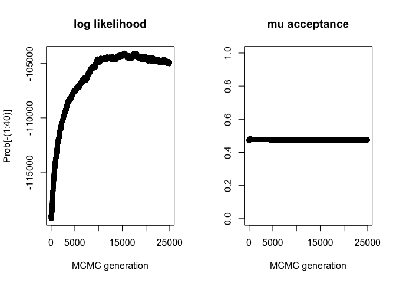
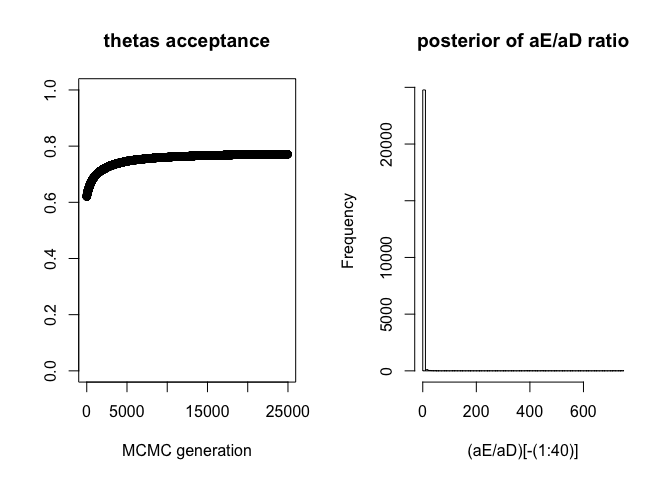
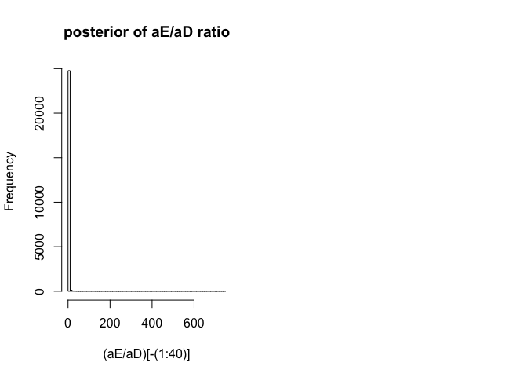

BEDASSLE troubleshooting
================

Here’s a reproducible example of the trouble I’m having getting
reasonable acceptance rates for the αE and α2 parameters, using a
representative example from our five focal species (extremely low global
FST / panmixia across all sampling localities). All the necessary data
should be in this folder; you’ll have to change paths. First, I’ll load
libraries and our locality data:

``` r
library(adegenet)
library(BEDASSLE)
library(dplyr)
library(fossil)
library(ecodist)
library(vcfR)
library(raster)

# read in locality data
localities <- read.csv("/Users/ethanlinck/Dropbox/scarab_migration/troubleshooting/scarab_spp_master.csv")
localities$short_locality[which(localities$short_locality=="730")] <- 800 # correct locality assignment error
pop.loc <- cbind.data.frame(unique(localities$long),unique(localities$lat),unique(localities$short_locality))
colnames(pop.loc) <- c("long", "lat", "pop")
geodist <- earth.dist(pop.loc[c("long", "lat")], dist = FALSE)
```

Next, I’ll download environmental data for our sampling localities from
worldclim, create a distance matrix using elevation, precipitation, and
MAT as variables, and bind this to our locality data:

``` r
# calculate environmental distance
worldclim <- getData("worldclim",var="bio",res=0.5,lon=localities$long[1],lat=localities$lat[1])
proj <- as.character(worldclim[[2]]@crs)
worldclim <- worldclim[[c(1,12)]]
names(worldclim) <- c("temp","precip")
sp1 <- SpatialPoints(localities[,c('long', 'lat')], proj4string=CRS(proj))
values <- extract(worldclim, sp1)
loc.master <- cbind.data.frame(localities, values)
loc.uniq <- cbind.data.frame(loc.master$locality, loc.master$elevation, loc.master$temp,
                             loc.master$precip) %>% distinct()
colnames(loc.uniq) <- c("population", "elevation", "temp", "precip")
rownames(loc.uniq) <- loc.uniq$population
loc.uniq <- as.data.frame(loc.uniq)
loc.uniq <- loc.uniq[,-which(names(loc.uniq) %in% c("population"))]
env.dist.all <- dist(loc.uniq, diag = TRUE, upper = TRUE)

# drop lower transect
loc.subset <- loc.uniq[-which(rownames(loc.uniq) %in% 
                                       c("CC1-800","CC2-925","CC3-1050","CC4-1175","CC1-730")),]
env.dist.upper <- dist(loc.subset, diag = TRUE, upper = TRUE)

# prep dist matrix
satanas.env <- as.matrix(env.dist.upper)
colnames(satanas.env) <- NULL
rownames(satanas.env) <- NULL
```

I’ll then load a stringently filtered, LD-trimmed .vcf file for
*Dichotomius satanas* and convert it to BEDASSLE’s input format:

``` r
# read in .vcf, turn to genpop
satanas.vcf <- read.vcfR("/Users/ethanlinck/Dropbox/scarab_migration/troubleshooting/d_satanas.LD.vcf", convertNA=TRUE)
```

    ## Scanning file to determine attributes.
    ## File attributes:
    ##   meta lines: 66
    ##   header_line: 67
    ##   variant count: 993
    ##   column count: 108
    ## 
    Meta line 66 read in.
    ## All meta lines processed.
    ## gt matrix initialized.
    ## Character matrix gt created.
    ##   Character matrix gt rows: 993
    ##   Character matrix gt cols: 108
    ##   skip: 0
    ##   nrows: 993
    ##   row_num: 0
    ## 
    Processed variant: 993
    ## All variants processed

``` r
satanas.gen <- vcfR2genind(satanas.vcf) 
satanas.pops <-  gsub( "_.*$", "", rownames(satanas.gen@tab)) # add pops
satanas.gen@pop <- as.factor(satanas.pops) # make factor
satanas.b <- genind2genpop(satanas.gen, satanas.pops) # turn into genpop
```

    ## 
    ##  Converting data from a genind to a genpop object... 
    ## 
    ## ...done.

``` r
# convert to BEDASSLE format
satanas.ac <- as.matrix(satanas.b@tab)
del <- seq(2, ncol(satanas.ac), 2) # sequence of integers to drop non-ref allele
satanas.ac <- satanas.ac[,-del] 

# create equally sized matrix for sample sizes
satanas.n <- matrix(nrow=nrow(satanas.ac), ncol=ncol(satanas.ac))

# name our rows the same thing
rownames(satanas.n) <- rownames(satanas.ac)

# get sample size per population
sample.n <- table(satanas.gen@pop) 

# turn this into a vector
sample.sizes <- as.vector(sample.n)

# populate each row of matrix with sample sizes for pops
for(i in 1:nrow(satanas.n)){
  satanas.n[i,] <- sample.sizes[i]
}
satanas.n <- satanas.n*2 # adjust to account for loss of one allele

# calculate pairwise Fst
satanas.p.fst.all <- calculate.all.pairwise.Fst(satanas.ac, satanas.n)

# look at global Fst
satanas.p.fst <- calculate.pairwise.Fst(satanas.ac, satanas.n)
drop.pop <- c("800","925","1050","1175") # drop levels from the other transect

# drop levels and calc distance
pop.loc.sat <- pop.loc[!pop.loc$pop %in% drop.pop,]
droplevels(pop.loc.sat)
```

    ##         long       lat        pop
    ## 5  -77.82785 -0.651119       1575
    ## 6  -77.82919 -0.647834       1700
    ## 7  -77.83251 -0.646252       1825
    ## 8  -77.83864 -0.639972       1950
    ## 9  -77.84010 -0.635938       HU-3
    ## 10 -77.84053 -0.642829       HU-4
    ## 11 -77.88798 -0.603911 Macucaloma
    ## 12 -77.88942 -0.597508   Yanayacu

``` r
satanas.geo <- earth.dist(pop.loc.sat[c("long", "lat")], dist = FALSE)

# turn to vectors
sat.dist <- as.vector(satanas.geo)
sat.gen <- as.vector(satanas.p.fst.all)

# make data frame with these variables
sat.df <- cbind.data.frame(sat.dist, sat.gen)
sat.df$species <- rep("dichotomius_satanas",nrow(sat.df))
colnames(sat.df) <- c("distance", "fst", "species")
```

Finally, a short run to demonstate what’s going on. I’ve put in step
sizes that seem to be performing the best after extensive testing. They
alternative produce acceptance rates for αE and α2 that are very close
to 1 or 0.

``` r
MCMC(   
  counts = satanas.ac,
  sample_sizes = satanas.n,
  D = satanas.geo,  # geographic distances
  E = satanas.env,  # environmental distances
  k = nrow(satanas.ac), loci = ncol(satanas.ac),  # dimensions of the data
  delta = 0.0001,  # a small, positive, number
  aD_stp = 0.6,   # step sizes for the MCMC
  aE_stp = 0.0685,
  a2_stp = 0.0665,
  thetas_stp = 0.2,
  mu_stp = 0.35,
  ngen = 50000,        # number of steps (2e6)
  printfreq = 250,  # print progress (10000)
  savefreq = 250,     # save out current state
  samplefreq = 2,     # record current state for posterior (2000)
  prefix = "/Users/ethanlinck/Dropbox/scarab_migration/bedassle/satanas_test_",   # filename prefix
  continue=FALSE,
  continuing.params=NULL)
```

    ## [1] 250
    ## [1] -119171.9
    ## [1] 500
    ## [1] -118267.1
    ## [1] 750
    ## [1] -117123.6
    ## [1] 1000
    ## [1] -116259.1
    ## [1] 1250
    ## [1] -115543.8
    ## [1] 1500
    ## [1] -114826.1
    ## [1] 1750
    ## [1] -114260.9
    ## [1] 2000
    ## [1] -113879.3
    ## [1] 2250
    ## [1] -113513.6
    ## [1] 2500
    ## [1] -112997.7
    ## [1] 2750
    ## [1] -112497.2
    ## [1] 3000
    ## [1] -112145.2
    ## [1] 3250
    ## [1] -111911.3
    ## [1] 3500
    ## [1] -111742.7
    ## [1] 3750
    ## [1] -111365.5
    ## [1] 4000
    ## [1] -111069.3
    ## [1] 4250
    ## [1] -110871.2
    ## [1] 4500
    ## [1] -110570.5
    ## [1] 4750
    ## [1] -110375.9
    ## [1] 5000
    ## [1] -110216.1
    ## [1] 5250
    ## [1] -110043.8
    ## [1] 5500
    ## [1] -109790.4
    ## [1] 5750
    ## [1] -109623.4
    ## [1] 6000
    ## [1] -109457
    ## [1] 6250
    ## [1] -109286.7
    ## [1] 6500
    ## [1] -109191.3
    ## [1] 6750
    ## [1] -108887.2
    ## [1] 7000
    ## [1] -108700.8
    ## [1] 7250
    ## [1] -108458.2
    ## [1] 7500
    ## [1] -108494.9
    ## [1] 7750
    ## [1] -108322.6
    ## [1] 8000
    ## [1] -108197.9
    ## [1] 8250
    ## [1] -108151.5
    ## [1] 8500
    ## [1] -108078.1
    ## [1] 8750
    ## [1] -108016.3
    ## [1] 9000
    ## [1] -107969.9
    ## [1] 9250
    ## [1] -107804.4
    ## [1] 9500
    ## [1] -107672
    ## [1] 9750
    ## [1] -107535.6
    ## [1] 10000
    ## [1] -107490.4
    ## [1] 10250
    ## [1] -107496.6
    ## [1] 10500
    ## [1] -107458.8
    ## [1] 10750
    ## [1] -107386.7
    ## [1] 11000
    ## [1] -107262.7
    ## [1] 11250
    ## [1] -107210.9
    ## [1] 11500
    ## [1] -107089.6
    ## [1] 11750
    ## [1] -107138.3
    ## [1] 12000
    ## [1] -107045.5
    ## [1] 12250
    ## [1] -106864.3
    ## [1] 12500
    ## [1] -106864.8
    ## [1] 12750
    ## [1] -106826.6
    ## [1] 13000
    ## [1] -106743.2
    ## [1] 13250
    ## [1] -106563.2
    ## [1] 13500
    ## [1] -106558.5
    ## [1] 13750
    ## [1] -106389.3
    ## [1] 14000
    ## [1] -106374.7
    ## [1] 14250
    ## [1] -106397.1
    ## [1] 14500
    ## [1] -106538.8
    ## [1] 14750
    ## [1] -106541.4
    ## [1] 15000
    ## [1] -106434.3
    ## [1] 15250
    ## [1] -106234.8
    ## [1] 15500
    ## [1] -106108.3
    ## [1] 15750
    ## [1] -105928.5
    ## [1] 16000
    ## [1] -105849.9
    ## [1] 16250
    ## [1] -105805.6
    ## [1] 16500
    ## [1] -105794.4
    ## [1] 16750
    ## [1] -105625.1
    ## [1] 17000
    ## [1] -105414.5
    ## [1] 17250
    ## [1] -105461.2
    ## [1] 17500
    ## [1] -105390.2
    ## [1] 17750
    ## [1] -105350.1
    ## [1] 18000
    ## [1] -105367.4
    ## [1] 18250
    ## [1] -105327
    ## [1] 18500
    ## [1] -105307.2
    ## [1] 18750
    ## [1] -105281
    ## [1] 19000
    ## [1] -104988.8
    ## [1] 19250
    ## [1] -104840.7
    ## [1] 19500
    ## [1] -104723
    ## [1] 19750
    ## [1] -104733
    ## [1] 20000
    ## [1] -104764.9
    ## [1] 20250
    ## [1] -104806.2
    ## [1] 20500
    ## [1] -104795.2
    ## [1] 20750
    ## [1] -104787
    ## [1] 21000
    ## [1] -104587.6
    ## [1] 21250
    ## [1] -104613.6
    ## [1] 21500
    ## [1] -104546
    ## [1] 21750
    ## [1] -104604.3
    ## [1] 22000
    ## [1] -104640.6
    ## [1] 22250
    ## [1] -104529.9
    ## [1] 22500
    ## [1] -104554.9
    ## [1] 22750
    ## [1] -104462.6
    ## [1] 23000
    ## [1] -104558.9
    ## [1] 23250
    ## [1] -104603.7
    ## [1] 23500
    ## [1] -104472.9
    ## [1] 23750
    ## [1] -104461.8
    ## [1] 24000
    ## [1] -104518.6
    ## [1] 24250
    ## [1] -104465.3
    ## [1] 24500
    ## [1] -104464.6
    ## [1] 24750
    ## [1] -104448.5
    ## [1] 25000
    ## [1] -104425.8
    ## [1] 25250
    ## [1] -104471.7
    ## [1] 25500
    ## [1] -104570.7
    ## [1] 25750
    ## [1] -104466.5
    ## [1] 26000
    ## [1] -104385.7
    ## [1] 26250
    ## [1] -104491.7
    ## [1] 26500
    ## [1] -104462.6
    ## [1] 26750
    ## [1] -104618.3
    ## [1] 27000
    ## [1] -104545.7
    ## [1] 27250
    ## [1] -104451.4
    ## [1] 27500
    ## [1] -104568.2
    ## [1] 27750
    ## [1] -104467.3
    ## [1] 28000
    ## [1] -104400.4
    ## [1] 28250
    ## [1] -104304.3
    ## [1] 28500
    ## [1] -104381.6
    ## [1] 28750
    ## [1] -104384.2
    ## [1] 29000
    ## [1] -104345.5
    ## [1] 29250
    ## [1] -104347.7
    ## [1] 29500
    ## [1] -104190.5
    ## [1] 29750
    ## [1] -104263.4
    ## [1] 30000
    ## [1] -104246.8
    ## [1] 30250
    ## [1] -104173.1
    ## [1] 30500
    ## [1] -104232.1
    ## [1] 30750
    ## [1] -104142.2
    ## [1] 31000
    ## [1] -104100.9
    ## [1] 31250
    ## [1] -104184.8
    ## [1] 31500
    ## [1] -104213.3
    ## [1] 31750
    ## [1] -104255.1
    ## [1] 32000
    ## [1] -104346.4
    ## [1] 32250
    ## [1] -104359.8
    ## [1] 32500
    ## [1] -104419.9
    ## [1] 32750
    ## [1] -104406.8
    ## [1] 33000
    ## [1] -104370.4
    ## [1] 33250
    ## [1] -104532.9
    ## [1] 33500
    ## [1] -104379.6
    ## [1] 33750
    ## [1] -104422.3
    ## [1] 34000
    ## [1] -104495.2
    ## [1] 34250
    ## [1] -104296.7
    ## [1] 34500
    ## [1] -104383.4
    ## [1] 34750
    ## [1] -104187.6
    ## [1] 35000
    ## [1] -104222.5
    ## [1] 35250
    ## [1] -104265.8
    ## [1] 35500
    ## [1] -104113.8
    ## [1] 35750
    ## [1] -104156.3
    ## [1] 36000
    ## [1] -104187
    ## [1] 36250
    ## [1] -104253.4
    ## [1] 36500
    ## [1] -104334.8
    ## [1] 36750
    ## [1] -104323
    ## [1] 37000
    ## [1] -104393.8
    ## [1] 37250
    ## [1] -104510.5
    ## [1] 37500
    ## [1] -104441.7
    ## [1] 37750
    ## [1] -104489.8
    ## [1] 38000
    ## [1] -104546.3
    ## [1] 38250
    ## [1] -104619.2
    ## [1] 38500
    ## [1] -104408
    ## [1] 38750
    ## [1] -104555.5
    ## [1] 39000
    ## [1] -104569.4
    ## [1] 39250
    ## [1] -104516.9
    ## [1] 39500
    ## [1] -104490.6
    ## [1] 39750
    ## [1] -104480.9
    ## [1] 40000
    ## [1] -104518.9
    ## [1] 40250
    ## [1] -104622.5
    ## [1] 40500
    ## [1] -104686.4
    ## [1] 40750
    ## [1] -104642.9
    ## [1] 41000
    ## [1] -104664.2
    ## [1] 41250
    ## [1] -104616
    ## [1] 41500
    ## [1] -104601.5
    ## [1] 41750
    ## [1] -104591.3
    ## [1] 42000
    ## [1] -104543.1
    ## [1] 42250
    ## [1] -104655
    ## [1] 42500
    ## [1] -104724.3
    ## [1] 42750
    ## [1] -104578
    ## [1] 43000
    ## [1] -104518.6
    ## [1] 43250
    ## [1] -104583.2
    ## [1] 43500
    ## [1] -104699.6
    ## [1] 43750
    ## [1] -104648.1
    ## [1] 44000
    ## [1] -104729.7
    ## [1] 44250
    ## [1] -104747.3
    ## [1] 44500
    ## [1] -104649.1
    ## [1] 44750
    ## [1] -104746.3
    ## [1] 45000
    ## [1] -104780.5
    ## [1] 45250
    ## [1] -104707.4
    ## [1] 45500
    ## [1] -104768.1
    ## [1] 45750
    ## [1] -104880.2
    ## [1] 46000
    ## [1] -104823.3
    ## [1] 46250
    ## [1] -104878.6
    ## [1] 46500
    ## [1] -104862.7
    ## [1] 46750
    ## [1] -104803.4
    ## [1] 47000
    ## [1] -104797.6
    ## [1] 47250
    ## [1] -104797.6
    ## [1] 47500
    ## [1] -104789.9
    ## [1] 47750
    ## [1] -104738
    ## [1] 48000
    ## [1] -104744.2
    ## [1] 48250
    ## [1] -104771.5
    ## [1] 48500
    ## [1] -104829.9
    ## [1] 48750
    ## [1] -104901
    ## [1] 49000
    ## [1] -104907.7
    ## [1] 49250
    ## [1] -104866
    ## [1] 49500
    ## [1] -104892.5
    ## [1] 49750
    ## [1] -104827.7
    ## [1] 50000
    ## [1] -104880

    ## [1] "Output 50000 runs to /Users/ethanlinck/Dropbox/scarab_migration/bedassle/satanas_test_MCMC_output*.Robj ."

``` r
# check shit out
show(load("/Users/ethanlinck/Dropbox/scarab_migration/bedassle/satanas_test_MCMC_output1.Robj"))
```

    ##  [1] "last.params"   "LnL_thetas"    "LnL_counts"    "LnL"          
    ##  [5] "Prob"          "a0"            "aD"            "aE"           
    ##  [9] "a2"            "beta"          "samplefreq"    "ngen"         
    ## [13] "a0_moves"      "aD_moves"      "aE_moves"      "a2_moves"     
    ## [17] "thetas_moves"  "mu_moves"      "beta_moves"    "aD_accept"    
    ## [21] "aE_accept"     "a2_accept"     "thetas_accept" "mu_accept"    
    ## [25] "aD_stp"        "aE_stp"        "a2_stp"        "thetas_stp"   
    ## [29] "mu_stp"

``` r
layout(t(1:2))
plot(aD, xlab="MCMC generation", ylab="value", main="aD")
plot((aD_accept/aD_moves)[-(1:40)], xlab="MCMC generation", ylab="", main="aD acceptance", ylim=c(0,1))
```

<!-- -->

``` r
plot(as.vector(aE)[-(1:40)], xlab="MCMC generation", ylab="value", main="aE")
plot((aE_accept/aE_moves)[-(1:40)], xlab="MCMC generation", ylab="", main="aE acceptance", ylim=c(0,1))
```

<!-- -->

``` r
plot(a2[-(1:40)], xlab="MCMC generation", ylab="value", main="a2")
plot((a2_accept/a2_moves)[-(1:40)], xlab="MCMC generation", ylab="", main="a2 acceptance", ylim=c(0,1))
```

<!-- -->

``` r
plot(Prob[-(1:40)], xlab="MCMC generation", main="log likelihood")
plot((mu_accept/mu_moves)[-(1:40)], xlab="MCMC generation", ylab="", main="mu acceptance", ylim=c(0,1) )
```

<!-- -->

``` r
plot((thetas_accept/thetas_moves)[-(1:40)], xlab="MCMC generation", ylab="", main="thetas acceptance", ylim=c(0,1) )
hist((aE/aD)[-(1:40)],breaks=100,main="posterior of aE/aD ratio")
```

<!-- -->

``` r
hist((aE/aD)[-(1:40)],breaks=100,main="posterior of aE/aD ratio")
mean(aE/aD)
```

    ## [1] 0.9346159

``` r
sd(aE/aD)
```

    ## [1] 20.53851

<!-- -->

Thoughts? My hunch is that there is extremely little signal of either
IBE or IBD in our data, but I don’t understand the MCMC procedure well
enough to have an intuitive grasp of how this would show up in our
posterior probability distributions.
